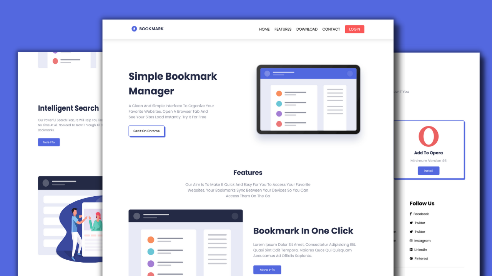

Complete Responsive Landing Page Website Tutorial #5: Footer Section | HTML - CSS - Javascript

Complete Responsive Landing Page Website Design Tutorial: 
1) Beautiful Landing Page HTML, CSS and JAVASCRIPT.
2) Responsive Navbar With Animation
3) Responsive Features Section Using Flexbox
4) Responsive Downloads Section Using CSS Grid
5) Compatible with all mobile devices and with a beautiful and pleasant user interface.

